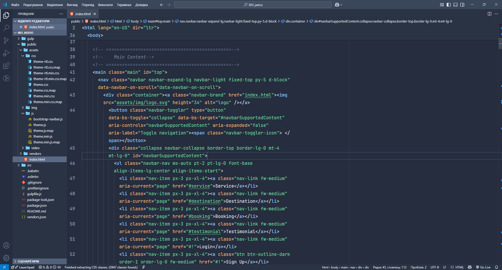
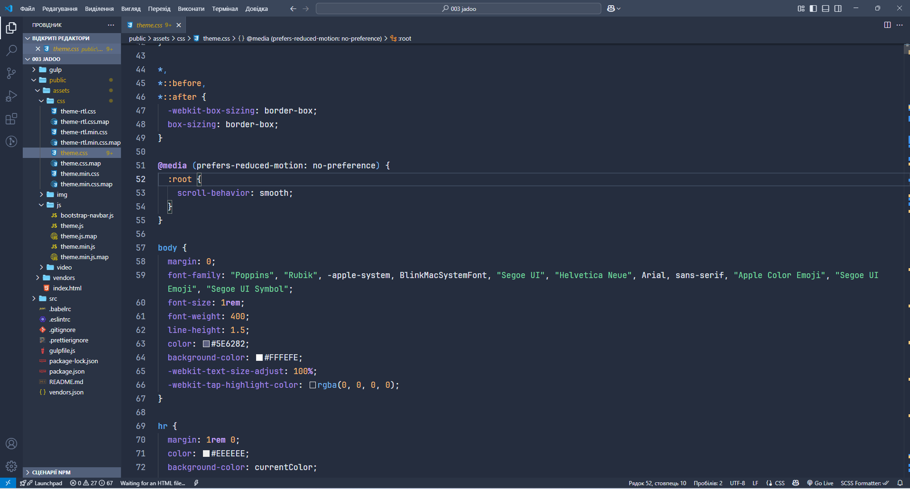
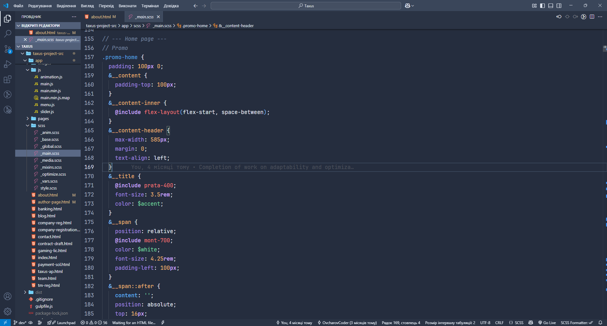
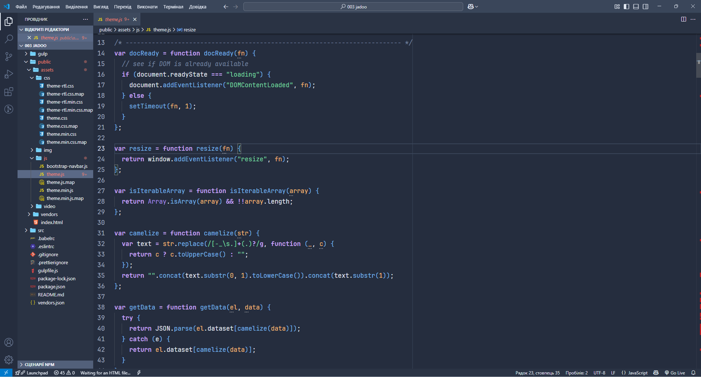
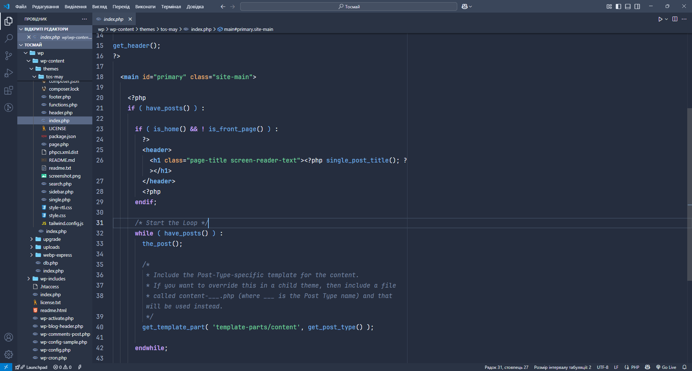

# Solaria Dark Theme 🌙

**Solaria Dark** is a dark theme for VS Code inspired by Nordic minimalism and the Tailwind CSS color palette. It features deep dark tones that are easy on the eyes at night, with clear contrasts for focused and productive coding.

## Features

- Clear syntax highlighting for JavaScript, PHP, HTML, CSS/SCSS
- Support for Tailwind CSS, Sass, and DOM API support
- Subtle, elegant colors for comments, functions, variables, and keywords

## Preview

**HTML** 
<br><br>
**CSS** 
<br><br>
**SCSS** 
<br><br>
**JS** 
<br><br>
**PHP** 


---

## Installation

1. Download from the [Marketplace](https://marketplace.visualstudio.com/items?itemName=ovcharovcoder.solaria-dark-theme)
2. Select the theme via `Preferences → Color Theme → Solaria Dark Theme`

---

## Tips for Best Experience

If bracket characters like `{}`, `()`, and `[]` appear too colorful or hard to read due to VS Code’s built-in bracket pair colorization, you can disable that feature to use the theme’s custom bracket coloring instead:


### Disable bracket pair colorization:

Open your `settings.json` and add:

```json
"editor.bracketPairColorization.enabled": false
```

---

## Development Date  
- Developed: May 2025

---

## Author

- Andriy Ovcharov
- E-mail: datoshcode@gmail.com

---

## License

MIT

